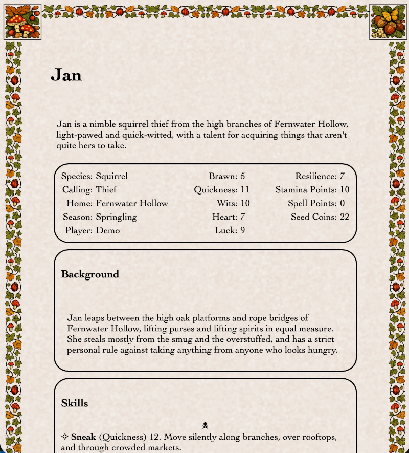

# Samphire

Samphire is a web-based character sheet server for tabletop role-playing games (TTRPGs), with XML-backed content and dynamic Vue components.

[](LICENSE.txt)
[](https://hub.docker.com/r/sjambler/samphire)
[](README.md)

## Table of Contents

- [Overview](#overview)
- [Who This Is For](#who-this-is-for)
- [Key Capabilities](#key-capabilities)
- [Getting Started](#getting-started)
- [Usage Guide](#usage-guide)
- [Character Sheet XML Guide](#character-sheet-xml-guide)
- [Demo Database Reference](#demo-database-reference)
- [Screenshots](#screenshots)
- [Troubleshooting](#troubleshooting)
- [Project Roadmap](#project-roadmap)
- [License](#license)

## Overview

Samphire is character sheet software for tabletop role-playing games (TTRPGs), aimed particularly at the many systems that do not have their own dedicated digital tools.

The philosophy is to keep things simple. Samphire is a practical replacement for pencil-and-paper sheets: players and games masters fill in and edit sheets in the browser, and the content is automatically saved to a database. Because every sheet is an XML document in [BaseX](https://basex.org/), the data can also be queried and manipulated with XQuery — useful for bulk updates, reporting, or building additional tooling.

Samphire contains no game logic and knows nothing about any particular rule system. Game-specific content — templates for character sheets, catalogues of skills, spells, weapons, talents, and so on — lives entirely in the database as XML. This means the same server can support any game you choose, and setting up a new system is a matter of authoring XML rather than writing code.

A demo database for a fictitious woodland fantasy game is included to illustrate what a working setup looks like.

## Who This Is For

**Games masters (GMs)** are the primary administrators of a Samphire installation. A GM sets up the server, creates user accounts, and builds the game-specific content: a template character sheet for the chosen rule system and catalogue documents listing skills, spells, weapons, talents, and any other options players may choose from. The GM then creates sheets for the player characters (and any NPCs they want to track), assigns ownership to each player, and controls who can read or edit each document.

**Players** use the browser to open and edit the sheets assigned to them. They can update individual fields, write free-form notes, and add items to lists by browsing the catalogues the GM has provided — no installation or technical knowledge required beyond a modern web browser.

This README focuses on getting the software running and using it as a GM or player. Information for developers who want to build or extend Samphire will be added in a later release.

## Key Capabilities

- **Game-agnostic** — works with any TTRPG rule system; no game logic is baked into the server.
- **Browser-based editing** — players and GMs edit sheets in any modern browser with no software to install.
- **Database-backed sheets** — all sheet content is stored in BaseX and kept in sync as you edit; changes to individual fields are written back incrementally as you make them.
- **Heterogeneous lists** — a single list can hold items of different types (e.g. melee weapons, ranged weapons, and armour in one Gear list), each with its own fields and layout.
- **Catalogue-driven item selection** — GMs define catalogues of available skills, spells, weapons, and so on; players add items to their sheets by browsing those catalogues rather than typing free text.
- **Rich text** — `y-text` fields support formatted prose (bold, italic, lists) via an embedded editor.
- **Flexible permissions** — each sheet has an owner, and separate read and write access lists. Access can be granted to named users or opened to everyone with a single wildcard value.
- **Configurable appearance** — the look of a sheet can be adjusted through `config.xml` or `y-style` elements embedded in the sheet XML itself, without touching server code.
- **XQuery access** — because all content is stored as XML in BaseX, a GM or administrator can query and bulk-update the entire database using XQuery.

## Screenshot



## Getting Started

### Deployment Scenarios

**Local (LAN/Wi-Fi)** — the GM runs the container on their own machine. Players on the same network open their browser and navigate to the GM's LAN IP address on port 8443, e.g. `https://192.168.1.10:8443/samphire/`. This is the simplest setup and requires no cloud account.

**Cloud (internet)** — the GM runs the container on a cloud host (e.g. a small VM). Players connect from anywhere using the server's public IP or hostname. The GM needs to open port 8443 in the provider's firewall or security group rules.

Both scenarios use HTTPS on port 8443 with a self-signed certificate, so players will need to accept a browser security warning the first time they connect.

### Prerequisites

You need a container runtime installed on the machine that will host Samphire.

**Recommended for local deployment: [Podman Desktop](https://podman-desktop.io/)** — free to use, works on Windows, macOS, and Linux. Podman Desktop installs the `podman` CLI alongside a graphical interface for managing containers.

**Alternative for local deployment: [Docker Desktop](https://www.docker.com/products/docker-desktop/)** — also works, but note that Docker Desktop may require a paid licence depending on your organisation size and use case.

**For cloud deployment** — install the `podman` or `docker` CLI directly on the VM using your distribution's package manager. No desktop application is required.

The `run-container.sh` script automatically uses `podman` if it is on your PATH and falls back to `docker` otherwise, so no changes to the script are needed when switching between the two.

No other software needs to be installed on the GM's machine. Players only need a modern web browser (Chrome, Firefox, Edge, or Safari).

### Obtain the Software

The recommended approach is to pull the pre-built image from Docker Hub. No source code is needed to run Samphire.

**Podman:**
```sh
podman pull docker.io/sjambler/samphire:latest
```

**Docker:**
```sh
docker pull docker.io/sjambler/samphire:latest
```

### Run the Software

Download `run-container.sh` and open it in a text editor. Before running it, make three edits:

1. **Set a strong password.** Replace every occurrence of `replace-with-strong-password` with a password of your choice. This password protects the TLS keystore and is not exposed to players.

2. **Set the certificate SAN.** Edit the `JETTY_SSL_CERT_SAN` line so that it includes the IP address or hostname players will use to connect. For example, for a local deployment where the GM's machine is at `192.168.1.10`:
   ```
   -e JETTY_SSL_CERT_SAN='dns:localhost,ip:127.0.0.1,ip:192.168.1.10'
   ```

3. *(Optional)* **Adjust the certificate subject.** The `JETTY_SSL_CERT_DNAME` line controls the name embedded in the certificate. The default (`CN=localhost,...`) is fine for most setups; change it only if your organisation requires a specific value.

Once edited, run the script:

```sh
./run-container.sh
```

The container starts in the background. Wait a few seconds for Jetty to initialise, then proceed to the next step. The database is stored in a named volume (`basex-data`) so your data persists across container restarts.

### Open the App and Sign In

Open your browser and navigate to:

```
https://<host>:8443/samphire/home
```

Replace `<host>` with `localhost` if you are on the same machine as the container, or with the server's LAN IP or public hostname for remote access.

Because Samphire uses a self-signed certificate, your browser will display a security warning. Proceed past the warning to open the app (the exact steps vary by browser — look for "Advanced" or "Show details" and then "Proceed" or "Accept the risk").

Sign in with username `admin` and password `admin`.

> **Important — change the admin password immediately.** Navigate to `https://<host>:8443/dba/users` (the BaseX administration interface) and set a strong password before doing anything else. Default credentials on a publicly reachable server are an open invitation to attack.

## Usage Guide

This section focuses on how to use the app in the browser. XML authoring and schema-level details are covered later in [Character Sheet XML Guide](#character-sheet-xml-guide).

### Sheet

A **sheet** is a web document with a defined structure but with content that users can edit. A character sheet is one example but the concept is more general than that.

Each sheet belongs to a **type** (effectively a folder/category in the database). Types are flexible and game-defined. Typical examples are:

- `template`: starting points prepared before play (for example class/archetype starter sheets used during character creation).
- `character`: active character records for player characters and important NPCs during a campaign.
- `group`: shared party-level tracking such as roster, shared inventory, campaign resources, or GM handouts.
- `catalogue`: curated option libraries used when adding entries to sheets (for example skills, spells, weapons, gear, talents).
- `general`: uncategorized or ad-hoc documents that do not fit a dedicated category yet.


#### Create a New Sheet (Clone)

If players create their own characters then the first step will most likely be to clone an existing sheet.

In the simplest case, all character sheets will be cloned from a single template.  However the GM may provide any number of templates, one for each archetype or character class, for instance.  The GM can make templates visible to the players by setting the read attribute to _everyone_.  

Players may choose any template to which they have read access.  When they clone it they become the owner of the new sheet.

> To create a new sheet from an existing one:
> 
>   1. Open the source sheet.
>   2. Click the **Clone** button (copy icon) at the bottom right.
>   3. Set **Location** to the destination type (for example `character` or `group` if left blank it defaults to `general`).
>   4. Set **Clone sheet as** to the new document name.
>   5. Click **Clone**.
> 
> Samphire creates the new sheet and opens it in a new browser tab.

#### Ownership and Permissions

Open the **Settings** dialog (cog icon) to manage access:

- **Owner**: primary owner of the sheet. Only an admin can change owner.
- **Read**: comma-separated usernames who can view the sheet.
- **Write**: comma-separated usernames who can edit the sheet.

For `Read` and `Write`, you can use `everyone`, `all`, or `public` as wildcards.

If no read or write value is set, access is restricted to the owner and admins.


### Cell

A **cell** is a small editable value in the sheet (for example a name, number, or short label).

Cells are the basic building blocks of a character sheet.  They will be used to capture all of the attributes and statistics associated with a character.  Cells can appear anywhere in the layout of a sheet, but Samphire also provides the facility to arrange them into _arrays_.  This gives the two-column format that is familiar from the stat-blocks in many games.  The arrays themselves may be arranged into _panels_ to give a pleasing layout.

> To edit a cell:
> 
>   - Click the cell to focus.  It will switch into edit mode.
>   - Add or amend the content as you wish.
>   - Press **Enter** or **Tab** to submit.
>   - If you type **Esc** or click elsewhere without submitting, it reverts.
>   - If submit fails, it also reverts so the view stays synchronized with stored data.

Cells accept a short amount of plain text but the values are not constrained. This is consistent with the ethos of a direct paper-and-pencil replacement.  It allows players and GM the freedom to annotate cells as they wish.  The GM might prepare a character template in which _Strength_ is a cell containing '3d6'.  A player could edit this to '14 (+3)' where the '+3' is the bonus for wearing their magic gauntlets.

### Text

A **text** field is the rich-text editor area used for longer prose.

Text areas allow players to add paragraphs with rich text formatting.  This might be used for the description of the character, e.g. their appearance, personality and foibles; and their backstory. It is a good idea for the GM to add a general _Notes_ section to the end of templates so that players can add any free-form notes during the course of the game.

> To edit a text area:
>
>   - Click the text area to focus.  The formatting toolbar will appear.
>   - Add or amend the text as you wish.
>   - Style the content using the formatting toolbar.
>   - Click **Save** (disk icon) to commit changes.
>   - Rich text is not auto-saved on blur.
>   - If save fails, the editor restores the previous saved state and shows an error.

YText supports emphasis, headings, lists, paragraph/horizontal-rule blocks, undo/redo, and explicit save from the toolbar.

| Action group | Supported actions |
| --- | --- |
| Emphasis | Bold, Italic, Underline, Strikethrough |
| Headings | Heading 1, Heading 2, Heading 3, Paragraph |
| Lists | Bulleted list, Numbered list |
| Structure | Horizontal rule |
| History | Undo, Redo |

### List and Catalogue

A **list** is an ordered collection of items.  A **catalogue** is a curated collection of items that may be added to a list.  

Lists and catalogues provide a general purpose way for players to select options from a predefined set.  Depending on the game, lists can be used to arrange skills, spells, weapons, armor, magical items, and so on.  The GM will generally set up the catalogues of available items in advance, but these can easily be extended as play progresses, e.g. to add new spells or custom weapons.

Lists are heterogeneous - there is no requirement that their elements all have the same structure or type.  A list of _Gear_ could contain weapons, armor, camping equipment, magic scrolls and ingredients for spells.  The different kinds of item may all come from different catalogues, or from a smaller number of combined catalogues. A catalogue is itself just a sheet with a number of heterogenous lists whose items can be searched and selected by name. The GM may decide, for convenience, to put melee weapons and ranged weapons together in a single _Weapons_ catalogue, even though they have different attributes.

> List controls include:
> 
>   - Drag-and-drop reorder.
>   - Selection mode (skull icon).
>   - Multi-delete selected items (`X` icon).
>   - Duplicate selected items (copy icon).

If a list has catalogues then they will appear under a horizonal rule at the end of the list. 

> To add items from a catalogue:
> 
>   1. Click a catalogue `+` button.
>   2. Type a search term, a few letters of the item you would like to find.  The dialog will show items whose name contains the given string of letters.
>   3. Select an item from the result.
>   4. Click **Add**.
> 
> Samphire inserts the selected item into the list and refreshes the view.

### Virtual Catalogue

In addition to list-based catalogues, each document type offers a _virtual catalogue_.  This means that the documents of a given type can be searched by name, and added to a list in the form of a link.  One could, for instance, add links to the player character sheets to a roster for the party.  Games that involve investigation might have a sheet to track the handouts.  The GM can configure such links to be accompanied by a short summary of the linked sheet.

### Collaboration and Conflicts

Samphire does not lock sheets for single-user editing, so if two people edit the same part of a sheet at the same time, the last successful write wins. If a sheet looks out of date (for example after a GM edits a player's sheet in the background), refresh the page to re-sync with the current database state. In practice, this is easiest to manage with light table etiquette: tell players when you are making live edits to their sheets, and ask them to refresh after major GM-side changes.

## Character Sheet XML Guide

Authoring a Samphire sheet means writing an XML document whose structure defines both the sheet's data and how it is rendered in the browser. Start with a `y-sheet` root, use semantic `tag` values to describe what each element represents in your game, and build layouts from containers such as `y-panel`, `y-array`, and `y-list`, then add editable fields with `y-cell` (short values) and `y-text` (rich prose). In practice, the easiest way to get started is to build one complete character sheet until the content and layout feel right, then clone that sheet to create your reusable template.

### Custom Element Reference

| XML element | Purpose | Renders as | Attributes |
| --- | --- | --- | --- |
| y-sheet | Root container for one editable sheet document; it defines sheet-level identity, semantics, permissions, and wraps all visible sheet content. | Rendered as the top-level page container (`div.y-sheet`) with the sheet content plus built-in action controls (settings/access, clone, delete) shown at the bottom. | `id` (required for writable sheets), `tag`, `owner`, `read`, `write`, `admin` (server-added when current user is admin). |
| y-title | Sheet title element used to name the document for readers and list views (for example character name, party name, or catalogue title). | Rendered as the main heading (`h1`) near the top of the sheet via the `YTitle` component. | No Samphire-specific attributes are required; plain text content is typically used as the sheet display title. |
| y-panel | Layout container for grouping and visually separating sections of a sheet (for example ability scores, equipment, notes). Direct children must be `y-panel-item` elements. | Rendered as a bordered, rounded box (`div.y-panel`) with flexbox row layout and space-between justification; creates a visual division on the sheet. | `id` (not currently used). |
| y-panel-item | Individual sub-section within a panel; wraps related content fields. | Rendered as a block-level container (`div.y-panel-item`) that flows within the parent panel's flex layout. | `id` (not currently used). |
| y-array | Compact stat-block container for paired values (for example attributes, derived stats, or tracked resources). Direct children must be `y-array-item` elements. | Rendered as a two-column CSS grid (`div.y-array`) sized to content, with alternating alignment so labels sit on the left and values on the right. | `id` (not currently used). |
| y-array-item | One label/value entry within a `y-array`; defines the display label and wraps the associated field or value content. | Rendered as two inline spans: a label span showing `label:` followed by a value span containing the item content. | `label` (required), `id` (not currently used). |
| y-cell | Inline editable value field for short text data (for example numbers, names, or brief notes) inside any sheet section. | Rendered as an inline `span.y-cell`; when writable, users edit in place and press Enter or Tab to submit, with updates posted immediately and content reverted if submit fails (or if edit is canceled). | `id` (required for writable behavior; when absent the cell is read-only). |
| y-text | Rich-text content area for longer prose (for example background notes, session logs, or free-form descriptions) with inline formatting controls. | Rendered as a TipTap editor block with a focus-sensitive toolbar (bold, italic, underline, headings, lists, undo/redo, save); content is persisted only when the Save button is clicked, and failed saves revert to the last saved version. | `id` (required for writable behavior; when absent the editor is read-only). |
| y-list | Container for heterogeneous collections (for example Gear, Spells, Contacts) where items can have different internal layouts but share one logical list. Direct children must be `y-list-item` elements, with an optional final `y-catalogue` child for add-from-catalogue sources. | Rendered as a block list (`div.y-list`) with list controls; writable lists support drag-and-drop reordering plus selection mode for multi-item delete, while read-only lists show content without edit controls. | `id` (required for writable list operations), `tag` (optional grouping key used by drag-and-drop behavior). |
| y-list-item | One entry row within a `y-list`, wrapping the item's visible fields and semantics (for example one weapon, one spell, or one linked sheet summary). | Rendered as a block row (`div.y-list-item`) with either a drag handle (normal mode) or a checkbox (selection mode), followed by the item content. | `id` (required for reliable selection/delete operations). |
| y-catalogue | Source-link container at the end of a `y-list` that defines where new items can be selected from. Direct children must be `y-catalogue-item` elements. | Rendered as a horizontal catalogue action row (`div.y-catalogue`) separated from list items by a top border; each child renders an add button/trigger. | `id` (not currently used). |
| y-catalogue-item | One selectable add-source for a list (for example Weapons, Skills, or a whole type as a virtual catalogue); opens a chooser and inserts the selected `y-list-item` into the parent list. | Rendered as a modal-trigger control with a plus icon and label; opens an item selector filtered by the configured source, then adds the chosen item on confirmation. | `url` (required), `label` (optional, default `Item`), `filter` (optional), `id` (required for writable behavior; when absent, adding is disabled). |
| y-summary | Embedded preview block for a linked sheet (commonly inside a `y-list-item`) that shows selected fields from the target document using the configured summary template. | Rendered as a summary container (`div.y-summary`) plus a refresh button; clicking refresh requests server-side regeneration of the summary from the linked sheet and updates the displayed content. | `url` (required, points to the linked sheet view URL), `id` (required for refresh/update action). |
| y-style | Inline stylesheet block for per-sheet visual customization without changing application code (for example typography, spacing, colors, or component-specific rules). | Not rendered as visible content; during page rendering, its text content is extracted server-side and injected into a `<style>` element in the document `<head>`, where it applies to the sheet. | No Samphire-specific attributes are required; `id` is not currently used. |

### Authoring Rules

1. Use the `tag` attribute to describe **what an element means in the game world**, not how it should look. Treat `tag` values as stable semantic labels (for example: `Character`, `Strength`, `Weapon`, `Spell`) that make XML easier to query, summarize, and link across sheets and catalogues. Prefer clear, consistent naming across your templates so the same concept always uses the same `tag`.
2. Every interactive `y-` element must have an `id` attribute, and each `id` must be unique within that sheet document. Samphire uses these IDs to target updates to the correct node in BaseX; duplicate or missing IDs can cause updates to fail or hit the wrong element. IDs are generated automatically when a sheet is cloned or uploaded through the Samphire UI. If you upload XML directly via the BaseX admin UI, you must _either_ ensure IDs are unique yourself _or_ run `ids:refresh-ids` in XQuery before use:
   ```
   import module namespace ids = "http://www.jsodium.org/samphire/ids" at "ids.xqm";
   let $doc := doc('/demo/character/Freida.xml')
   return ids:refresh-ids((), $doc)
   ```
3. Permissions are controlled by `owner`, `read`, and `write` on `y-sheet`. The `owner` is the primary controller of the sheet and always has read/write access; `read` and `write` are optional comma-separated username lists for additional viewers/editors. To open access broadly, set `read` or `write` to one wildcard value: `everyone`, `public`, or `all` (these are equivalent). If `read`/`write` are omitted, access remains restricted to the owner (and admins).
4. Container elements require specific direct children. A `y-array` must contain only `y-array-item` children; a `y-panel` must contain only `y-panel-item` children; and a `y-catalogue` must contain only `y-catalogue-item` children. A `y-list` must contain `y-list-item` children, with one exception: the final child may be a `y-catalogue` block that defines add-from-catalogue sources. Keeping these direct-child relationships strict avoids rendering and update errors.

## Demo Database Reference

The demo database is an example dataset for a fictional woodland fantasy game. It includes a root configuration file (`config.xml`), reusable templates (for example a hero sheet and party sheet), sample character and group documents, and multiple catalogue documents (items, skills, spells, talents, weapons) used by `y-catalogue-item` selectors. Use it as a reference implementation for structure and conventions: you can inspect how templates, lists, catalogue links, and summary formatting fit together, then copy and adapt the same patterns for your own game system.

Directory map of the demo database (`basex/sample/demo`):

```text
demo/
   config.xml
   catalogue/
      items.xml
      skills.xml
      spells.xml
      talents.xml
      weapons.xml
   character/
      Cecil.xml
      Freida.xml
      Jan.xml
      Melony.xml
   group/
      BriarPatchGang.xml
   template/
      Hero.xml
      Party.xml
```

### Example Snippets

These examples use the demo database files above. They illustrate the use of the XML tags and how they can be combined. `id` attributes are omitted for readability.

#### 1) Sheet header with title and rich-text description

Source: [character/Jan.xml](basex/sample/demo/character/Jan.xml)

```xml
<y-sheet tag="Character">
   <y-title>
      <y-cell tag="Name">Jan</y-cell>
   </y-title>
   <y-text tag="Description">
      <p>Jan is a nimble squirrel thief from the high branches of Fernwater Hollow,
      light-pawed and quick-witted, with a talent for acquiring things that aren't
      quite hers to take.</p>
   </y-text>
   <!-- more -->
</y-sheet>
```

#### 2) Character stat block (panel + array + editable cells)

Source: [character/Jan.xml](basex/sample/demo/character/Jan.xml)

```xml
<y-panel>
   <y-panel-item>
      <y-array>
         <y-array-item label="Species"><y-cell tag="Species">Squirrel</y-cell></y-array-item>
         <y-array-item label="Calling"><y-cell tag="Calling">Thief</y-cell></y-array-item>
         <y-array-item label="Home"><y-cell tag="Home">Fernwater Hollow</y-cell></y-array-item>
         <!-- more -->
      </y-array>
   </y-panel-item>
</y-panel>
```

#### 3) List with add-from-catalogue source

Source: [character/Jan.xml](basex/sample/demo/character/Jan.xml)

```xml
<y-list tag="Skills">
   <y-list-item tag="Skill">
      <b><y-cell tag="Name">Sneak</y-cell></b>
      (<y-cell tag="Stat">Quickness</y-cell>)
      <y-cell tag="Level">12</y-cell>
      <!-- more -->
   </y-list-item>
   <!-- more -->
   <y-catalogue>
      <y-catalogue-item filter="Skill" label="Skill" url="/samphire/data/demo/type/catalogue/sheet/skills"/>
   </y-catalogue>
</y-list>
```

#### 4) Party list with virtual catalogue and linked summaries

Source: [group/BriarPatchGang.xml](basex/sample/demo/group/BriarPatchGang.xml)

```xml
<y-list>
   <y-list-item>
      <a href="/samphire/data/demo/type/character/sheet/Jan/view" target="_blank"><b>Jan</b></a>
      <y-summary url="/samphire/data/demo/type/character/sheet/Jan/view">
         <i>Br</i> <y-cell>5</y-cell>,
         <i>Qu</i> <y-cell>11</y-cell>,
         <i>Wi</i> <y-cell>10</y-cell>,
         <!-- more -->
      </y-summary>
   </y-list-item>
   <!-- more -->
   <y-catalogue>
      <y-catalogue-item filter="Character" label="Character" url="/samphire/data/demo/type/character"/>
   </y-catalogue>
</y-list>
```

## License

This project is licensed under the terms in (LICENSE.txt)[LICENSE.txt].

## Acknowledgements

This software would not have been possible without the fantasic work
of all those who contribute to the (BaseX)[https://basex.org] project.
